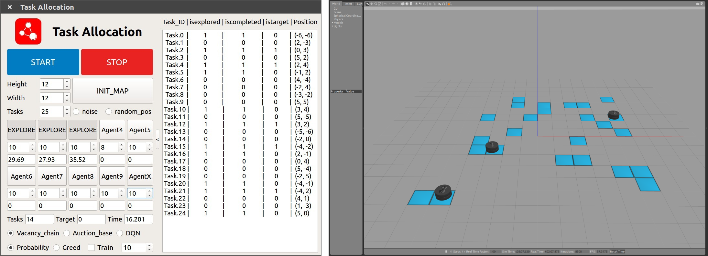
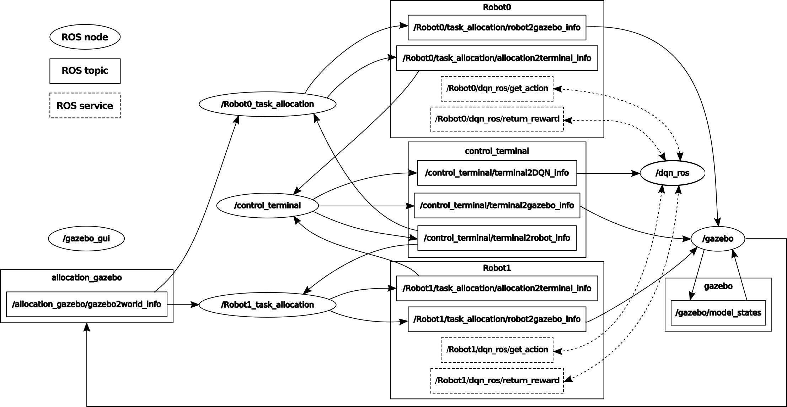
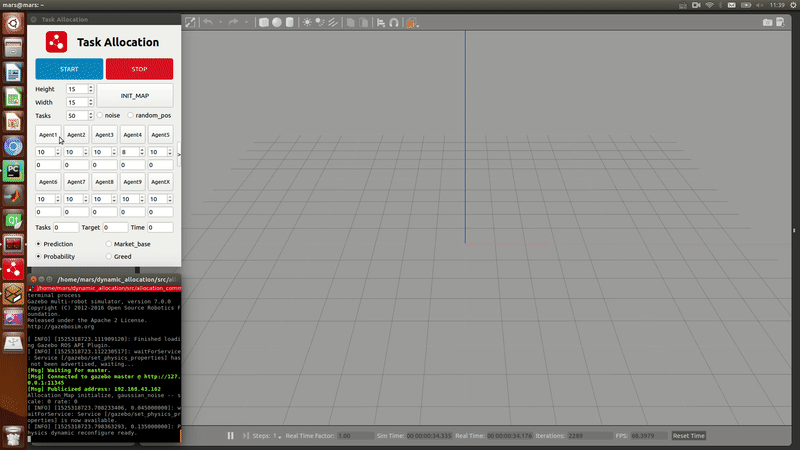

#   Dynamic_task_allocation

We built a simulation environment combining the Robot Operating System (ROS) with Gazebo, which is suitable for dynamic multi-robot task allocation. The simulation system adopts distributed programming,
i.e., each simulated robot runs the whole program independently under different ROS nodes. In this way, the simulation system is close to the real environment, featuring communication delay, world model synchronization and other common problems of distributed systems. The map size, the number of tasks and the number of robots, etc. can be customized.

## Runtime environment

Branch **master** :

1. Ubuntu 16.04
2. ROS Kinetic
3. Python 3.5
4. Gazebo version 7.0 (the full ROS Kinetic includes the Gazebo 7.0)

Branch **18.04_melodic** :

1. Ubuntu 18.04
2. ROS Melodic
3. Python 3.5
4. Gazebo version 9.0 (the full ROS Melodic includes the Gazebo 9.0)

## Build

Place the package in your workspace content, and then:

`$ cd dynamic_allocation`

`$ catkin_make --pkg allocation_common`

`$ catkin_make`

## Run

### roscore

We need to initiate a **roscore** in any path with the following command:

`$ roscore`

### dpn_ros

The Deep Q-learning network is built with **tensorflow** (Python), and we need to launch it separately:

`$ export PYTHONPATH="Your_path"+/dynamic_allocation/devel/lib/python2.7/dist-packages:$PYTHONPATH`

`$ cd dynamic_allocation/src/DQN/srcipts/`

`$ python3 train.py`

If you do not need the approach with DQN, you can skip this step.

### other nodes

We can launch the other nodes by using a single launch file:

`$ cd dynamic_allocation/`

`$ source devel/setup.sh`

`$ roslaunch allocation_common dynamic_allocation.launch`

Now, you can see a QT Gui for control terminal and the simulation environment in Gazebo:

 

## Framework of simulation system

There are six components included in the simulation system:

1. **allocation common:**  including the core definitions, ROS messages and ROS services that the simulation system used;
2. **allocation gazebo:** including the model plug-ins and world plug-in which implement the model control and state feedback in Gazebo;
3. **control terminal:** the QT GUI with control buttons and information browsers, it is convenient for user operation and state visualization;
4. **DQN:** Deep Q-learning network built with tensorflow;
5. **gazebo description:** describing the robot model, task model and world of allocation with sdf;
6. **task allocation:** the core program that contains the auction-based, vacancy chain and deep Q-learning approach.

The rosgraph of the simulation system with two robots:

## How to use

The nodes in this system exchange information using topics and services. Each simulated robot is associated with a *task_allocation* node, and the communication becomes more complicated with more robots. The simulation system is a simplified environment for exploration and destruction problem, where the blue areas are the suspicious locations that need to be explored. A robotic team collaborates to complete the exploration and destruction tasks. Before the mission starts, we need to set some parameters in advance:

- **Height and width:**  the map size for this exploration;
- **Number of tasks and robots:** the number of the suspicious locations in the map and the number of robots in the team;
- **Strike ability:** the strike ability Pi of each robot;
- **Noise:** whether to add Gaussian noise to the localization of robots;
- **Starting point:** whether to start at a random position, and if not, all robots start from the lower left point of the map;
- **Approach:** which approach is used in task allocation: auction-based, vacancy chain, deep Q-learning);
- **Probability or Greed:** if using vacancy chain approach, the strategy for destruction task selection can be chosen from greedy and non-greedy;
- **Train and times:** if using deep Q-learning approach, it is divided into two modes: training and testing. And the times of trainings can be set.

With this specially designed simulation system, it is very convenient to complete the simulation experiment of dynamic task allocation for the MRS. It can also be extended for other multi-robot scenarios.

### video example

## Notice

If you make use of this work, please cite [my paper](https://www.researchgate.net/profile/Huimin_Lu/publication/336816063_Multi-Robot_Dynamic_Task_Allocation_for_Exploration_and_Destruction/links/5db45103299bf111d4d03a02/Multi-Robot-Dynamic-Task-Allocation-for-Exploration-and-Destruction.pdf): **Dai W, Lu H, Xiao J, et al. Multi-Robot Dynamic Task Allocation for Exploration and Destruction[J]. Journal of Intelligent & Robotic Systems, 2019: 1-25.**